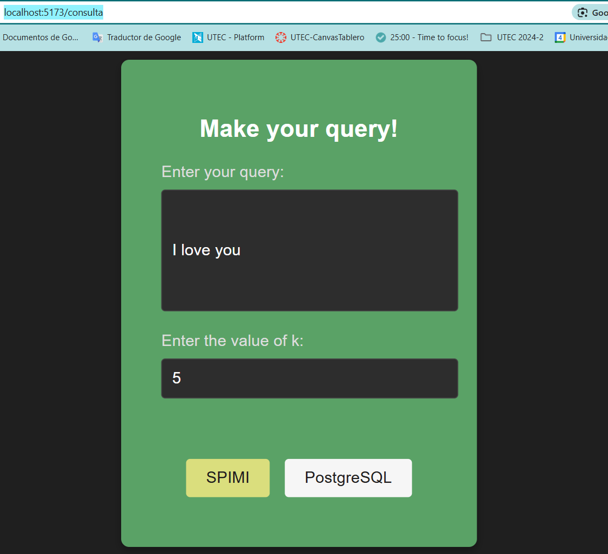
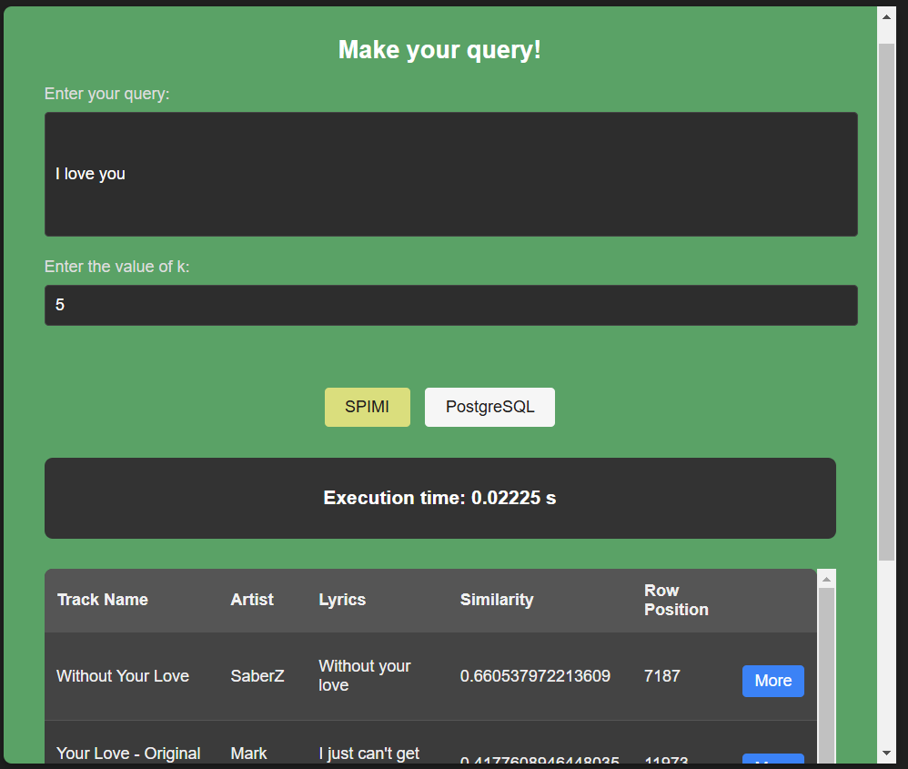
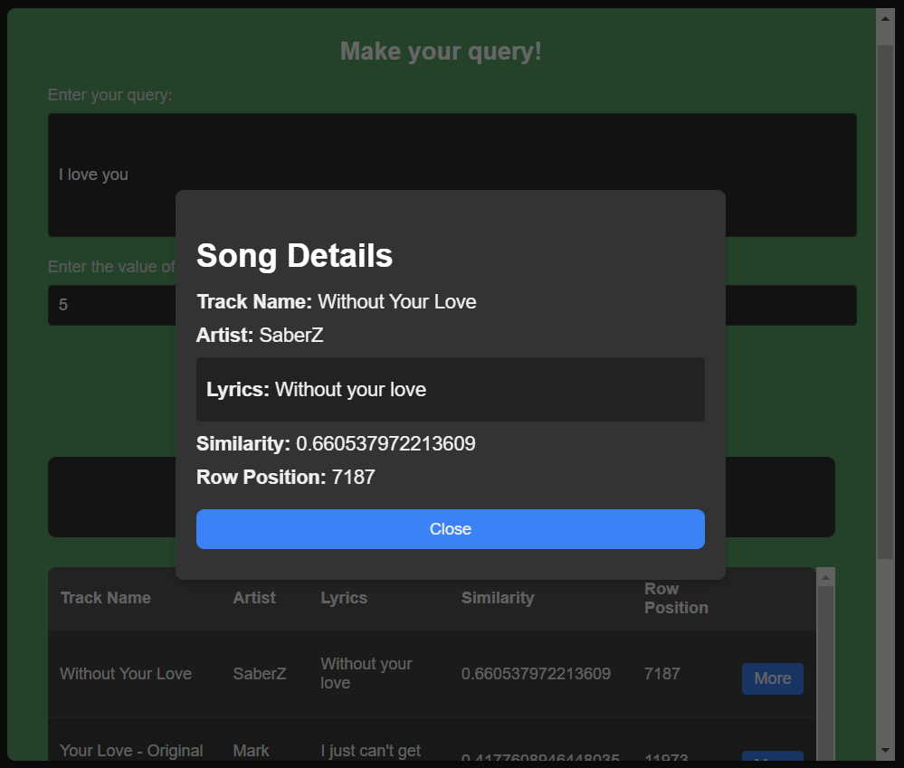
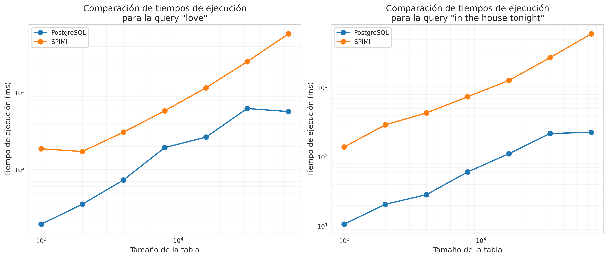

# Proyecto2

### Autores

|                                                                             | Nombre                                                                   | GitHub                                                     |
| --------------------------------------------------------------------------- | ------------------------------------------------------------------------ | ---------------------------------------------------------- |
|                         | [Mariel Carolina Tovar Tolentino](https://github.com/MarielUTEC)         | [@MarielUTEC](https://github.com/MarielUTEC)               |
|                   | [Noemi Alejandra Huarino Anchillo](https://github.com/NoemiHuarino-utec) | [@NoemiHuarino-utec](https://github.com/NoemiHuarino-utec) |
|  | [Sergio Sebastian Sotil Lozada](https://github.com/Sergio-So)            | [@Sergio-So](https://github.com/Sergio-So)                 |
|                     | [Davi Magalhaes Eler](https://github.com/CS-DaviMagalhaes)               | [@CS-DaviMagalhaes](https://github.com/CS-DaviMagalhaes)   |
|                     | [Jose Eddison Pinedo Espinoza](https://github.com/EddisonPinedoEsp)      | [@EddisonPinedoEsp](https://github.com/EddisonPinedoEsp)   |

## Introducción

### Objetivo

Desarrollar y aplicar algoritmos de recuperación de información utilizando índices invertidos en memoria secundaria, que permitan realizar consultas textuales y obtener las canciones más relevantes en función de la coincidencia con la consulta.

### Dominio de datos

Utilizamos un dataset que contiene `18454` canciones de Spotify, retirado desde Kaggle: [dataset](https://www.kaggle.com/datasets/imuhammad/audio-features-and-lyrics-of-spotify-songs/data).

El archivo `spotify_songs.csv` contiene 25 columnas, de las cuales utilizamos los siguientes 5:

- `track_id`: Identificador de la canción en spotify.
- `track_name`: Nombre de la canción.
- `track_artist`: Artista principal de la canción.
- `lyrics`: Letra completa de la canción.
- `track_album_name`: Álbum al que la canción pertenece.

Dado que las consultas están orientadas a la búsqueda textual por similitud, consideramos que los demás atributos, como popularidad, género, tono, entre otros, no son especialmente relevantes para este tipo de aplicación.

### Importancia de la indexación

En este dominio de datos, la indexación es fundamental para optimizar la eficiencia de las consultas. Podemos considerar cada fila del archivo como un documento, ya que tiene cientos de palabras que constituyen la letra de una canción, las cuales deben ser indexadas. Dado que estamos trabajando con cientos de miles de palabras que se repiten en múltiples documentos, la indexación permite organizar y acceder rápidamente a la información relevante, evitando búsquedas secuenciales costosas y permitiendo recuperar de manera eficiente las coincidencias más relevantes para cada consulta. Sin un buen sistema de indexación, la búsqueda entre este gran volumen de datos sería lenta e ineficiente.

## Backend

Esta aplicación de backend está diseñada para manejar procesamiento, almacenamiento y recuperación de datos de canciones a gran escala. Incluye:

1. **Indexación Invertida Basada en SPIMI** para una recuperación eficiente de texto y cálculo de similitud de coseno.
2. **Integración con Base de Datos PostgreSQL** para almacenar metadatos de canciones y letras con un índice GIN.
3. **API** para realizar búsquedas y recuperar datos de canciones.

## 1. SPIMI (Single-Pass In-Memory Indexing)

La clase `SPIMI` gestiona la indexación a gran escala y la recuperación eficiente de letras de canciones utilizando un índice invertido. Incluye:

- **Carga de Datos**: Lee datos de canciones (ID de pista, nombre, artista y letras) desde un archivo CSV.
- **Preprocesamiento**: Tokeniza, elimina palabras vacías y realiza la derivación de palabras.
- **Construcción del Índice**: Divide los datos en bloques, indexa frecuencias de términos y calcula las normas de cada documento.
- **Similitud de Coseno**: Calcula la similitud entre la consulta y los documentos para devolver resultados relevantes.
- **Gestión de Archivos**: Guarda archivos de índice intermedios y los fusiona en un índice final almacenado en formato JSON.

### Ejemplo de Uso

Para inicializar y construir el índice, carga los datos desde un archivo CSV:

```python
spimi = SPIMI(csv_path='./backend/data/spotify_songs.csv')
query = 'hello'
result = spimi.busqueda_topK(query, k=5)
print(result)
```

El índice invertido final ordenado alfabeticamente es generado en el archivo `indiceFinal.json`, que además de las referencias a los documentos de cada palabra, también guarda las frecuencias y al final del archivo las normas. Por ejemplo:

```
{"diccionario": [["aconstumbr", [[1, 1], [10, 5]]], ["blood", [[3, 4], [7, 1]]], ... ], "normas": {"0": 4.723972227312666, "1": 2.9813075013013317, ... }}
```

- El token `"acostumbr"` ya fue preprocesado. En el primer documento aparece 1 vez, en el documento de id 10 aparece 5 veces. Como es el primer término su índice de norma seria `"0"`, con valor `4.723972227312666`.
- El token `"blood"` ya fue preprocesado. En el tercer documento aparece 4 veces, en el séptimo documento aparece 1 vez. Es el segundo término, su índice de norma es `"1"` con valor `2.9813075013013317`.

Si el archivo de índice ya existe el `SPIMI` solo lo utiliza. No necesita crearlo denuevo.

## 2. Integración con PostgreSQL

### 2.1 Descripción General

La clase `PostgresConnector` se encarga de manejar la conexión y las operaciones con una base de datos PostgreSQL. Esta clase facilita la carga de datos, la configuración de la base de datos y la realización de búsquedas eficientes utilizando índices GIN y vectores de búsqueda. 

La implementación maneja la funcionalidad para:
- Gestionar conexiones a PostgreSQL
- Configurar la estructura de la base de datos
- Realizar búsquedas optimizadas usando índices GIN y vectores tsvector
- Cargar y mantener los datos de canciones

### 2.2 Estructura de la Base de Datos

```sql
CREATE TABLE spotify_songs (
    track_id VARCHAR PRIMARY KEY,
    track_name VARCHAR, 
    track_artist VARCHAR,
    lyrics TEXT,
    search_vector tsvector
);
```
El campo `search_vector` es crucial para la búsqueda optimizada, almacenando el texto procesado en formato vectorial.

### 2.3 Componentes Principales

#### Conexión y Configuración

```python
def connect(self):
    self.conn = pg.connect(
        user="edd",
        password="***",
        host="localhost",
        database="spotify_songs"
    )
```

#### Índices y Optimización
- Implementación de índice GIN para búsquedas de texto completo
- Vector de búsqueda tsvector con pesos por campo
- Trigger automático para mantener vectores actualizados

#### Carga de Datos
- Verificación de datos existentes para evitar duplicados
- Procesamiento de archivos CSV
- Actualización automática de vectores de búsqueda

### 2.4 Funcionalidad de Búsqueda
#### Método Principal de Búsqueda

```python
def search(self, query, k=5):
    # Preprocesamiento de query
    # Búsqueda usando ts_rank_cd
    # Ordenamiento por similitud
    return {
        'query_time': tiempo_ejecución,
        'results': resultados_ordenados
    }
```
#### Características
- Búsqueda por similitud usando ts_rank_cd
- Soporte para consultas parciales
- Resultados ordenados por relevancia
- Límite configurable de resultados (top-k)

### 2.5 Uso del Sistema
```python
# Inicialización
db = PostgresConnector()
db.setup_database()

# Carga de datos
db.load_data('./data/spotify_songs.csv')

# Ejemplo de búsqueda
resultados = db.search("love", k=5)
```

### 2.6 Detalles de Implementación

#### Vectorización y Búsqueda

El sistema implementa una búsqueda vectorial sofisticada mediante tsvector:

```sql
CREATE OR REPLACE FUNCTION update_search_vector()
RETURNS trigger AS $$
BEGIN
    NEW.search_vector = 
        setweight(to_tsvector('english', COALESCE(NEW.track_id,'')) || 
                to_tsvector('spanish', COALESCE(NEW.track_id,'')), 'A') ||
        setweight(to_tsvector('english', COALESCE(NEW.track_name,'')) || 
                to_tsvector('spanish', COALESCE(NEW.track_name,'')), 'B') ||
        setweight(to_tsvector('english', COALESCE(NEW.lyrics,'')) || 
                to_tsvector('spanish', COALESCE(NEW.lyrics,'')), 'D');
    RETURN NEW;
END;
$$ LANGUAGE plpgsql;
```

#### Sistema de Ranking
La búsqueda utiliza `ts_rank_cd` para calcular la relevancia:

```sql
SELECT 
    track_name,
    track_artist,
    ts_rank_cd(search_vector, query_vector) as similitud
FROM spotify_songs
WHERE search_vector @@ query_vector
ORDER BY similitud DESC
```

### 2.7 Ejemplos de Uso
Búsqueda 
```python
# Buscar canciones con la palabra "love"
results = db.search("love", k=5)

# Ejemplo de resultado
{
    'query_time': 0.0234,
    'results': [
        {
            'track_name': 'All You Need Is Love',
            'track_artist': 'The Beatles',
            'similitud': 0.89
        },
        # ... más resultados
    ]
}
```

## 3. API

El archivo de API `api1.py` contiene el código de una API REST construida con Flask, diseñada para manejar búsquedas utilizando dos métodos de indexación: SPIMI y PostgreSQL. La API recibe consultas de búsqueda de una aplicación cliente, realiza la búsqueda usando uno de los métodos especificados y devuelve los resultados.

#### Descripción General

1. **_Importaciones y Configuración Inicial_**:

   - Se importan los módulos necesarios, incluyendo Flask, CORS para permitir solicitudes desde otros dominios, y `logging` para registro de eventos y errores.
   - Las clases `SPIMI` y `PostgresConnector` se importan, que contienen las funcionalidades de búsqueda con los métodos SPIMI y PostgreSQL, respectivamente.

2. **_Configuración de Logging_**:

   - Se configura el sistema de logging en nivel `INFO`, lo que permite registrar mensajes importantes y errores en la consola para facilitar la depuración.

3. **_Inicialización de la Aplicación y CORS_**:

   - Se crea una instancia de Flask para la API (`app = Flask(__name__)`) y se habilita CORS para permitir que la API reciba solicitudes de diferentes orígenes.

4. **_Inicialización del Índice SPIMI_**:

   - Se carga el índice SPIMI desde un archivo CSV (`spotify_songs.csv`). Este archivo contiene los datos que serán indexados y buscados utilizando el método SPIMI.

5. **_Inicialización de PostgreSQL_**:
   - Se inicializa la base de datos PostgreSQL usando el conector `PostgresConnector`, que crea la base de datos y tablas necesarias para la búsqueda.

#### Endpoints de la API

La API tiene dos endpoints principales: `/search/spimi` y `/search/postgres`. Ambos reciben solicitudes POST para realizar búsquedas, y cada uno emplea un método de indexación distinto.

1. **`/search/spimi` - Búsqueda usando SPIMI**:

   - **_Método_**: `POST`
   - **_Descripción_**: Este endpoint recibe una consulta (query) y un valor `k` que determina el número de resultados a retornar. Utiliza el método de indexación **_SPIMI_** para realizar la búsqueda.
   - **_Cuerpo de la Solicitud_**:
     ```json
     {
       "query": "texto de búsqueda",
       "k": 5
     }
     ```
     - `query`: El término de búsqueda que ingresa el usuario.
     - `k`: La cantidad de resultados a mostrar (por defecto, 5 si no se proporciona).
   - **_Proceso_**:
     - La API valida que el `query` esté presente.
     - Luego, se ejecuta el método `busqueda_topK` del índice SPIMI para obtener los resultados de la búsqueda.
   - **_Respuesta_**:
     - La API devuelve un objeto JSON con la lista de resultados, el método utilizado y el tiempo de ejecución de la consulta.
     ```json
     {
       "method": "SPIMI",
       "query_time": 0.05,
       "results": [
         {
           "lyrics": "Sample lyrics",
           "row_position": 1,
           "similitudCoseno": 0.85,
           "track_artist": "Artist",
           "track_id": "Sample ID",
           "track_name": "Song Name"
         }
       ]
     }
     ```
   - **_Error Handling_**: Si ocurre algún error durante la búsqueda, se registra en el log y la API responde con un mensaje de error.

2. **`/search/postgres` - Búsqueda usando PostgreSQL**:
   - **_Método_**: `POST`
   - **_Descripción_**: Similar al endpoint SPIMI, pero utiliza una base de datos PostgreSQL para realizar la búsqueda.
   - **_Cuerpo de la Solicitud_**:
     ```json
     {
       "query": "texto de búsqueda",
       "k": 5
     }
     ```
   - **_Proceso_**:
     - La API valida que el `query` esté presente.
     - Se llama al método `search` de `PostgresConnector` para ejecutar la consulta en PostgreSQL y obtener los resultados.
   - **_Respuesta_**:
     - La API devuelve un objeto JSON con la lista de resultados, el método utilizado y el tiempo de ejecución de la consulta.
     ```json
     {
       "method": "PostgreSQL",
       "query_time": 0.1,
       "results": [
         {
           "lyrics": "Sample lyrics",
           "row_position": "(1,2)",
           "similitud": 25.1,
           "track_artist": "Artist",
           "track_id": "sample ID",
           "track_name": "Song Name"
         }
       ]
     }
     ```
   - **_Error Handling_**: Similar al endpoint SPIMI; los errores se registran y se devuelve un mensaje de error en caso de falla.

#### Ejecución de la API

Para ejecutar esta API, primero entrar a la carpeta `backend`:

```bash
cd backend
```

Luego, utilizar los siguientes comandos en la terminal:

```bash
python postgres.py
```

```bash
python api1.py
```

## Frontend

### 1. Tecnologías Utilizadas

Utilizamos las siguientes tecnologías para el desarrollo del frontend:

- **React**: Biblioteca de JavaScript para construir interfaces de usuario.
- **Vite**: Herramienta de construcción rápida para aplicaciones web.
- **TypeScript**: Superset de JavaScript que agrega tipado estático.

### 2. Componentes Principales

La aplicación se organiza en dos componentes principales:

1. **Home.tsx**

   - **Ruta**: `/`
     - Página principal con dos opciones:
  
       - Ir a la página de consultas.
       - Visitar el repositorio del proyecto.
  
       

2. **Consulta.tsx**

   - **Ruta**: `/consulta`

     -Página para realizar consultas personalizadas:
     
     

     - Página de resultados luego de realizar la consulta:

     

     - Página de la ventana emergente que muestra los datos detallados para cada canción:
     

### 3. Diseño de la GUI

Esta aplicación permite que el usuario realice búsquedas de canciones usando dos métodos de indeación: **_SPIMI_** y **_PostgreSQL_**.

#### **_Inputs_**:

1. **Ingresar consulta** ("Enter your query"):

   - En esta sección el usuario puede escribir la palabra o frase a buscar.

2. **Cantidad de resultados** ("Enter the value of k"):

   - Aquí el usuario debe ingresar el número de resultados que quiere que se muestren.

3. **Método de Indexación**:

   - Si el usuario quiere realizar la búsqueda con el método de indexación **_SPIMI_**, debe presionar el botón que dice **SPIMI**.
   - Si el usuario quiere realizar la búsqueda con el método de indexación **_PostgreSQL_**, debe presionar el botón que dice **PostgreSQL**.

#### **_Outputs_**:

1. **Tiempo de Consulta ("Query Time"):**

   - Muestra el tiempo que tomó realizar la búsqueda en milisegundos.

2. **Resultados de la búsqueda:**
   - Se muestra una tabla con los resultados que coinciden con la búsqueda. Se muestra:
     - `Track_name`: Nombre de la canción
     - `Artist`: Nombre del artista
     - `Lyrics`: letra de la canción
     - `Similitud`: Muestra la similitud de la canción relacionada a la búsqueda
     - `row_position`: posición que ocupa la canción en la data
     - `Detail`: Contiene un botón de "ver" para visualializar los datos a detalle para cada canción.

### 4. Requisitos

Para correr el proyecto, asegúrate de tener instalados los siguientes requisitos:

- `Node.js`: versión mayor o igual a 18.
- `React`
- `Vite`

### 5. Configurar y ejecutar la aplicación

Para ejecutar el frontend localmente, sigue estos pasos:

- Clona el repositorio:

  ```bash
  git clone https://github.com/Dateadores/Proyecto2
  ```

- Accede a la carpeta `Frontend`:

  ```bash
  cd Frontend
  ```

- Instala las dependencias del proyecto:
  ```bash
  npm i
  ```
- Ejecuta el servidor de desarrollo:
  ```bash
  npm run dev
  ```

## Pruebas Experimentales

### Configuración del Experimento

Se realizaron pruebas comparativas entre dos implementaciones de búsqueda:
1. PostgreSQL con índices GIN y vectores tsvector
2. Implementación propia SPIMI en memoria secundaria

Las pruebas consistieron en:
- Conjuntos de datos de diferentes tamaños: 1000, 2000, 4000, 8000, 16000, 32000 y 64000 registros
- Dos consultas de prueba: 
  - Query simple: "love"
  - Query compuesta: "in the house tonight"
- 3 iteraciones por cada combinación de tamaño y consulta
- Medición de tiempos de respuesta en milisegundos

### Resultados



#### Comparación de Rendimiento

PostgreSQL demostró un rendimiento significativamente superior en ambos tipos de consultas:

1. **Query Simple "love"**:
   - PostgreSQL: 
     - Con 1K registros: 19.38ms
     - Con 64K registros: 569.24ms
     - Factor de crecimiento: ~29x
   - SPIMI:
     - Con 1K registros: 186.26ms 
     - Con 64K registros: 5848.63ms
     - Factor de crecimiento: ~31x

   **Análisis**: Para la consulta simple, PostgreSQL mantuvo tiempos de respuesta hasta 10 veces más rápidos que SPIMI. 
   El crecimiento en tiempo de ejecución fue más controlado en PostgreSQL, mostrando mejor escalabilidad.
   La diferencia más notable se observó en conjuntos grandes (64K), donde PostgreSQL procesó la consulta en ~0.57 segundos vs 5.85 segundos de SPIMI.

2. **Query Compuesta "in the house tonight"**:
   - PostgreSQL:
     - Con 1K registros: 10.66ms
     - Con 64K registros: 226.46ms
     - Factor de crecimiento: ~21x
   - SPIMI:
     - Con 1K registros: 138.76ms
     - Con 64K registros: 5989.17ms
     - Factor de crecimiento: ~43x

   **Análisis**: En consultas compuestas, la diferencia fue aún más marcada:
   - PostgreSQL mostró mejor rendimiento con consultas compuestas que con simples
   - SPIMI experimentó una degradación más severa al procesar múltiples términos
   - La optimización de índices GIN en PostgreSQL demostró ser especialmente efectiva para consultas multi-término

**Observaciones clave**:
- PostgreSQL mantiene tiempos sub-segundo incluso con 64K registros
- SPIMI muestra degradación más pronunciada al aumentar la complejidad de la consulta
- La brecha de rendimiento se amplía significativamente con el aumento del tamaño de datos
- El factor de crecimiento más controlado en PostgreSQL indica mejor manejo de recursos y optimización

### Análisis de Resultados

1. **Ventajas de PostgreSQL**:
   - Uso eficiente de índices GIN (Generalized Inverted Index)
   - Vectores tsvector precomputados y optimizados
   - Motor de base de datos maduro con optimizaciones internas
   - Mejor manejo de memoria y caché

2. **Limitaciones de SPIMI**:
   - Overhead por lectura/escritura de archivos JSON en disco
   - Procesamiento secuencial de bloques
   - Mayor costo en cálculos de similitud coseno

3. **Escalabilidad**:
   - PostgreSQL muestra un crecimiento más controlado en tiempos de respuesta
   - SPIMI exhibe un crecimiento más pronunciado al aumentar el tamaño de datos

### Conclusiones

1. PostgreSQL demuestra ser significativamente más eficiente para búsquedas textuales, con tiempos de respuesta hasta 10 veces más rápidos que SPIMI.

2. La diferencia de rendimiento se amplía conforme aumenta el tamaño de datos, evidenciando mejor escalabilidad de PostgreSQL.

3. Las optimizaciones internas de PostgreSQL (índices GIN, vectores tsvector) superan la implementación básica de SPIMI en memoria secundaria.

4. Para aplicaciones en producción que requieran búsqueda de texto eficiente, PostgreSQL representa una opción más robusta y escalable.


